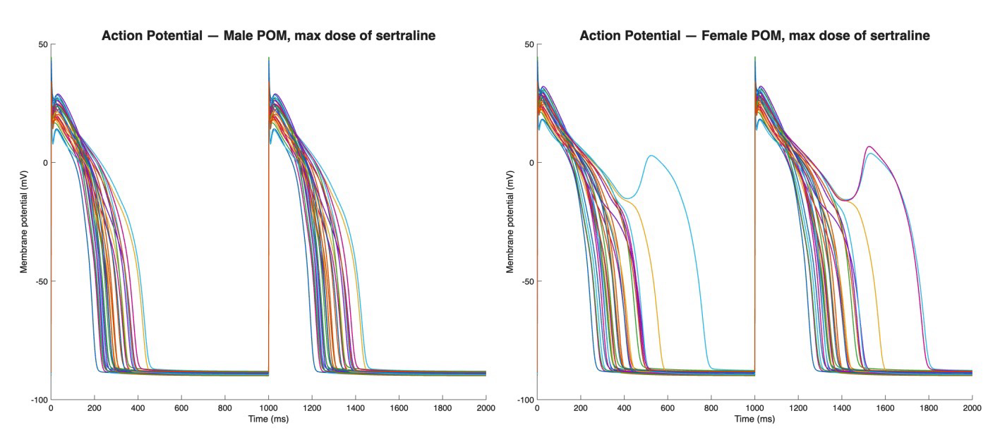
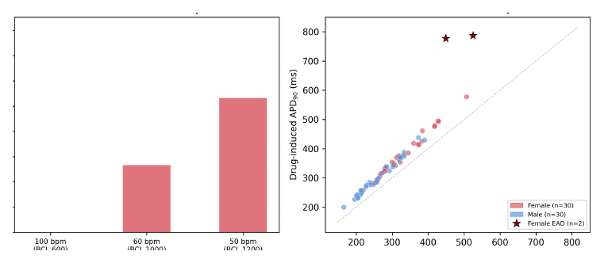
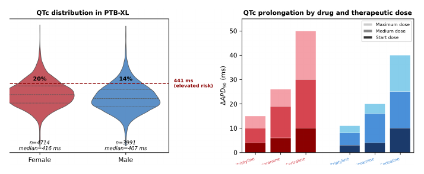

---

*Computational Medicine, MSc in Advanced Computer Science, University of Oxford.*

  <a class="button" style="flex:1;text-align:center;margin:0;padding:5px 10px;background:rgba(0,0,0,0.1);" href="report.pdf">Report</a>
  <a class="button" style="flex:1;text-align:center;margin:0;padding:5px 10px;background:rgba(0,0,0,0.1);" href="https://github.com/alexandre-bismuth/Computational-Medicine/tree/main/Mini-Project">Code</a>

---

##### Overview

While antidepressant prescriptions have tripled in 20 years, their cardiac ion channel block — which can trigger arrhythmias such as Torsades de Pointes — remains under-evaluated, particularly for women whose reduced baseline *IKr* elevates risk not accounted for in current sex-neutral models and prescribing guidelines. This study leverages the ToR-ORd ventricular cell model to quantify how electrophysiological sex differences affect vulnerability to arrhythmias induced by sertraline (an SSRI), amitriptyline and desipramine (two TCAs).

We find that female models develop early afterdepolarisations at therapeutic doses whereas male models do not; sertraline shows the greatest risk followed by amitriptyline, while desipramine remains EAD-free due to compensatory *ICaL* block. These results provide sex-differentiated evidence of quantifiably higher antidepressant-induced arrhythmic risk for women.

---

##### Method: a population of in-silico hearts

ToR-ORd represents cardiomyocytes on MATLAB by capturing depolarisation, repolarisation, and calcium dynamics through the Hodgkin-Huxley framework, where ionic currents are modelled as conductance-gating products and drug effects are captured by the Hill equation. Rather than relying on a single average-patient simulation, the study combines it with a population-of-models approach — generating 30 samples per sex with Latin Hypercube Sampling over seven ion channel conductances — which detects minority cases that average simulations miss. Sex differences are introduced by scaling six ionic conductances in line with existing literature, notably reducing *IKr* by 18% for female models. To bridge single-cell results to clinical ECGs, single-cell *APD*90 is mapped to QTc and validated against PTB-XL, a public dataset of 21,837 annotated 12-lead ECGs filtered down to 8,798 normal records. To keep the pipeline reproducible, IC50 values and Hill coefficients are taken from published literature and the sampling seed is fixed.

<figure style="margin:10px auto;text-align:center;">
  
  <figcaption style="font-size:0.82em;opacity:0.75;margin-top:6px;">Action potentials at the maximum therapeutic dose of sertraline — <strong>left: male patients</strong>, <strong>right: female patients</strong>.</figcaption>
</figure>

Sex-driven additional arrhythmia risk is evident from the early afterdepolarisations (EADs) — the secondary depolarising humps — observed in a subset of the female population (right) at the maximum therapeutic dose of sertraline, which are entirely absent in the male population (left).

---

##### Arrhythmia is driven by IKr block

Varying the basic cycle length shows that sertraline is more dangerous at rest: at slower heart rates, *IKr* block yields longer action potentials, allowing calcium channels to recover from inactivation and re-activate early, creating EADs. Comparing the three compounds isolates the mechanism — sertraline's lower *IKr* IC50 achieves the strongest fractional hERG block and the highest risk, while desipramine triggers no EADs despite producing 73% greater *APD*90 prolongation than amitriptyline, because its compensatory *ICaL* block reduces the inward current that sustains the plateau and triggers EADs. This directly supports the claim that QTc prolongation alone is an insufficient predictor of arrhythmic risk. Baseline and drug-induced *APD*90 nonetheless correlate closely, and the top 23% of female models show extreme prolongation (3× longer than the bottom 80%) — a boundary used to define a simulation-derived risk threshold.

---

##### Mapping simulation onto real ECGs

Applying the simulation-derived risk threshold to 8,705 normal PTB-XL ECGs, **20% of women fall into the elevated-risk category compared to only 14% of men** — a split that closely matches the simulation data to within 3%. Comparing both sexes across all antidepressants and dosages confirms that women consistently experience greater QTc prolongation. The model is stress-tested for credibility: baseline *APD*90 reproduces the known sex gap in normal PTB-XL ECGs, the QTc-prolongation ranking aligns with clinical thresholds distinguishing torsadogens, and varying the most sensitive parameters (IC50 by ±25% and the female *IKr* factor by ±10%) leaves the ranking intact, with women remaining the only patients to trigger EAD.

---

##### Key results

+ Female cardiomyocyte models develop early afterdepolarisations at therapeutic antidepressant doses, whereas male models do not.
+ Arrhythmic risk is driven by **IKr block**, with sertraline the most cardiotoxic and desipramine EAD-free despite greater *APD*90 prolongation — showing QTc prolongation alone is an insufficient predictor.
+ Mapping onto 8,705 PTB-XL ECGs places **20% of women vs 14% of men** in the elevated-risk tier, supporting sex-differentiated prescription guidelines.
