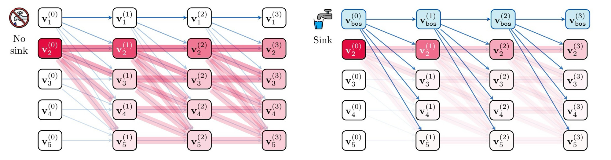
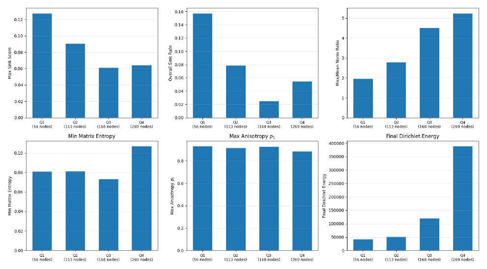
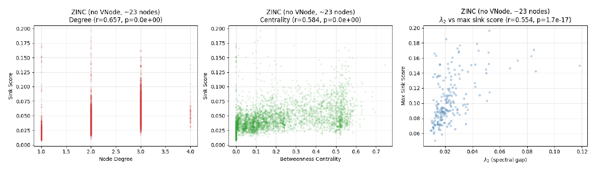
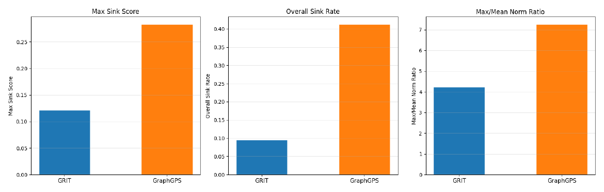

---

*Geometric Deep Learning, MSc in Advanced Computer Science, University of Oxford.*

  <a class="button" style="flex:1;text-align:center;margin:0;padding:5px 10px;background:rgba(0,0,0,0.1);" href="report.pdf">Report</a>
  <a class="button" style="flex:1;text-align:center;margin:0;padding:5px 10px;background:rgba(0,0,0,0.1);" href="https://github.com/alexandre-bismuth/Geometric-Deep-Learning">Code</a>

---

##### Overview

Large Language Models empirically attend heavily to the semantically meaningless `<BOS>` token that precedes every text sequence, creating an "attention sink" that has revealed critical for over-mixing regularisation. This phenomenon remains unexplored for Graph Transformers and cannot be spontaneously derived, as permutation equivariance and full global attention suppress the asymmetric sequential pressure that drives accumulation on the first tokens.

This project extends a multi-layer sensitivity bound to Graph Transformers, yielding two novel results: full attention *weakens* sink pressure with increasing context sizes (a behaviour opposite to LLMs), and edge-conditioned gating lowers mixing pressure by reducing the spectral gap of the effective mixing matrix. These findings are corroborated with empirical observations on sink scores, representational compression, and over-smoothing.

<figure style="margin:10px auto;max-width:560px;text-align:center;">
  
  <figcaption style="font-size:0.82em;opacity:0.75;margin-top:6px;">Without a sink (left), information mixes freely across tokens and representations collapse; a sink (right) parks attention on a designated token, slowing the mixing that drives over-smoothing.</figcaption>
</figure>

---

##### Extending the sensitivity bound to graphs

The theoretical study adapts the multi-layer sensitivity bound of Barbero et al. (2025) from causal LLMs to bidirectional, edge-conditioned graph attention as implemented in GRIT. Deriving the end-to-end sensitivity of a node's representation through the Jacobian reveals two structural differences with LLMs. First, the absence of a causal mask removes the asymmetric mixing pressure that accumulates on the earliest tokens, so there is no privileged "first node" onto which attention can concentrate. Second, structural edge encodings reduce the spectral gap of the effective mixing matrix, which lowers the rate at which stacking attention layers drives every representation towards the mean. Under uniform attention, the off-diagonal entries of the layered mixing matrix scale inversely with the number of nodes — meaning that, contrary to LLMs where longer contexts force accumulation on `<BOS>`, larger graphs actually *dilute* per-pair mixing pressure.

---

##### Emergence of attention sinks at varying context lengths

Testing on the Peptides-func dataset — whose graphs range from about 30 to 300 nodes — lets us study sink formation for variable context sizes on the same task, a setting that in LLMs strongly favours sinks. A sink is defined as a (layer, head) pair where at least one node has a sink score above 0.3, and the metrics are tracked alongside representational compression (norm ratio, matrix entropy, anisotropy) and over-smoothing (Dirichlet energy). Sink rates empirically always remain below established thresholds and further decrease as node count increases: the GRIT architecture shows a 15.8% sink rate for the smallest graphs and 5.5% for the largest ones, both well below the 30% threshold of Barbero et al. (2025). Dirichlet energy rises with context length, indicating that larger graphs retain more feature diversity and resist over-smoothing more effectively — consistent with the theoretical intuition that more nodes dilute mixing pressure.

---

##### Characterising which nodes become sinks

Correlating structural properties of nodes with their sink score, even in the setting where GRIT's sink rate is highest, reveals weak but consistent patterns that generalise poorly. Higher-degree nodes show higher sink scores — intuitive, since the Random Walk positional encoding visits high-degree nodes more often and makes them better candidates for sink formation. At the graph level, well-connected graphs consistently show higher sink scores than poorly connected ones through a spectral gap analysis. Bridge nodes with high betweenness centrality also develop higher sink rates, consistent with a "routing" interpretation of sinks, while leaves — with a betweenness centrality of zero — reveal much lower sink scores than other nodes.

---

##### Message-passing creates sink formation pressure

In contrast to the task-independence of sink formation, its emergence is highly dependent on architecture. Comparing the pure Graph Transformer GRIT against the hybrid GraphGPS — which adds a message-passing component on top of global attention — on the same ZINC dataset isolates the effect of architecture from that of the task. GraphGPS yields a max sink score of 0.28 and a sink rate above 40%, exceeding the 30% threshold, whereas GRIT stays well below it. The message-passing stream introduces enough local mixing to create a conditioning akin to LLMs, whereas GRIT's pairwise edge residual stream provides each layer with structural information that is never destroyed by node-level over-mixing. Overall, this suggests that attention-sink formation is inversely proportional to the amount of structural information that can travel through the network — and that the sinks seen in LLMs are more a consequence of their causal, minimal relational design than a fundamental property of the Transformer.

---

##### Key results

+ Extends the multi-layer sensitivity bound of Barbero et al. (2025) to bidirectional, edge-conditioned graph attention, deriving why sink pressure dilutes rather than concentrates as graphs grow.
+ Sink rates in GRIT fall from **15.8% to 5.5%** as graphs grow — the opposite of the LLM behaviour where longer contexts strengthen sinks.
+ Adding a message-passing stream (GraphGPS) pushes the sink rate **above 40%**, confirming that sink formation is architecture-dependent rather than a fundamental property of the Transformer.
