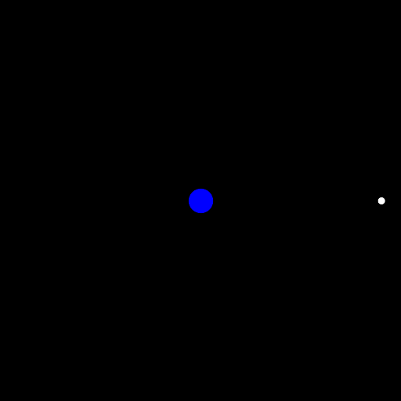
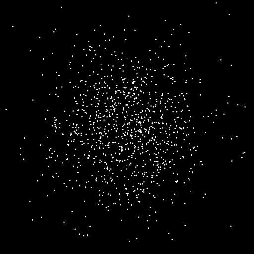

---

*Concurrent Programming (CSE305), Bachelor of Science, École Polytechnique — Academic year 2024/2025.*

  <a class="button" style="flex:1;text-align:center;margin:0;padding:5px 10px;background:rgba(0,0,0,0.1);" href="report.pdf">Report</a>
  <a class="button" style="flex:1;text-align:center;margin:0;padding:5px 10px;background:rgba(0,0,0,0.1);" href="https://github.com/alexandre-bismuth/CSE305-NBodySimulation">Code</a>

---

##### Overview

The goal of this project is to implement a gravity simulation capable of calculating the trajectories of tens of thousands of astronomical bodies by considering all pairwise gravitational interactions (whose number grows quadratically relative to the number of bodies). This project explores how to implement and significantly optimize this simulation using parallel computing techniques.

The work is built in four stages, each one compounding on the last:

1. **The straightforward implementation** — a sequential N-Body simulator with its own renderer written with the *Magick++* library, using Newton's law of universal gravitation to compute the resulting force applied on each body and update positions accordingly.
2. **Parallelization** — a parallel algorithm with dynamic load balancing for force computation and position updating, alongside parallelized image creation to avoid an I/O bottleneck.
3. **Barnes-Hut Algorithm** — a hierarchical force approximation that takes force computation from O(*n*²) to O(*n* log *n*).
4. **CUDA Implementation** — a GPU implementation that takes advantage of the numerous GPU cores to perform force computation, reaching huge speed-ups.

---

##### Visualising the simulation

Using the *Magick++* library, a renderer object creates an image at every iteration of the loop displaying the current body positions, and concatenates every frame into a GIF at 24 FPS. This allows us to get impressive visual results and verify the correctness of our program.

  <figure style="flex:1 1 240px;max-width:300px;margin:0;text-align:center;">
    
    <figcaption style="font-size:0.82em;opacity:0.75;margin-top:4px;">Solar system over 1 year, daily timesteps</figcaption>
  </figure>
  <figure style="flex:1 1 240px;max-width:300px;margin:0;text-align:center;">
    
    <figcaption style="font-size:0.82em;opacity:0.75;margin-top:4px;">Earth-Moon system over 1 month, 6-hour timesteps</figcaption>
  </figure>
  <figure style="flex:1 1 240px;max-width:300px;margin:0;text-align:center;">
    
    <figcaption style="font-size:0.82em;opacity:0.75;margin-top:4px;">Jupiter and its 4 largest moons over 1 month, 2-hour timesteps</figcaption>
  </figure>

---

##### Parallelizing with dynamic load balancing

For a simulation with 5 thousand bodies that lasts one month (with day-steps), the sequential program spends 99.9% of its time calculating all of the pairwise interactions. Splitting the upper-triangular force matrix across threads helps, but the naive split is heavily unbalanced — the first thread can take 19% of the work instead of 10%. Introducing an **atomic counter** that points to the next available row enables near-perfect thread balancing, taking the speed-up from **3.70× to 8.15×** on 10 threads. A dedicated rendering thread further removes the I/O bottleneck by creating each frame in parallel with the next force computation.

---

##### The Barnes-Hut algorithm

To further accelerate force computation, the simulation implements the Barnes-Hut algorithm, allowing us to go from O(*n*²) to O(*n* log *n*) performance. Space is recursively divided into quadrants; distant clusters are approximated as a single mass located at their center of mass, while nearby bodies are handled individually. A precision parameter *θ* controls the accuracy-performance trade-off, and dynamic load balancing again keeps threads busy on clustered versus isolated bodies. With *θ* = 0.20, the simulation keeps its divergence metric under 1% while drastically cutting computation time.

---

##### GPU-accelerated galaxies with CUDA

The CUDA framework enables us to use NVIDIA GPUs (which have huge amounts of threads available) to perform computations in extreme parallel. On an RTX A5000 with 12 288 concurrent threads, assigning one matrix entry per thread achieves perfect load balancing across the upper-triangular interaction matrix. This runs 5 thousand bodies over a month in **0.660 seconds** — a **20.4× improvement** over the parallel implementation with load balancing — while keeping the average divergence per body on the order of 10⁻¹⁰%.

<figure style="margin:10px auto;max-width:520px;text-align:center;">
  
  <figcaption style="font-size:0.82em;opacity:0.75;margin-top:6px;">Galactic simulation with 10,000 stars over 600 million years</figcaption>
</figure>

<figure style="margin:10px auto;max-width:520px;text-align:center;">
  
  <figcaption style="font-size:0.82em;opacity:0.75;margin-top:6px;">1000 random bodies over 6 months with daily timesteps</figcaption>
</figure>

---

##### Key results

+ Dynamic load balancing lifts the parallel solver from a **3.70× to an 8.15×** speed-up on 10 threads.
+ Barnes-Hut brings force computation from **O(*n*²) to O(*n* log *n*)** while keeping divergence under **1%** at *θ* = 0.20.
+ The CUDA implementation runs 5 thousand bodies over a month in **0.660 s** (20.4× over the load-balanced parallel version), with divergence on the order of **10⁻¹⁰%**.
+ Pushed to the limit, the simulation runs **100 thousand bodies** over a month (with day-steps) in **about 30 seconds**.
