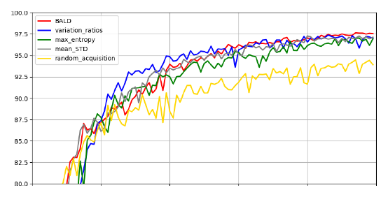
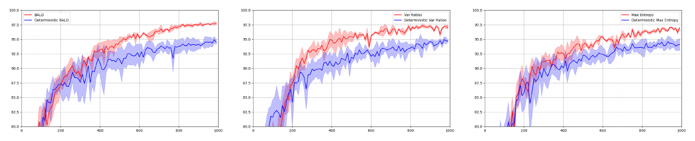
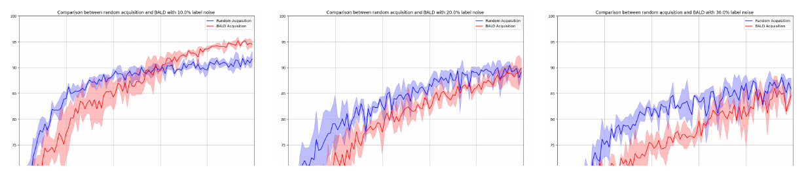
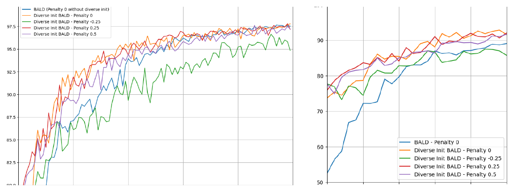

---

*Uncertainty in Deep Learning, MSc in Advanced Computer Science, University of Oxford.*

  <a class="button" style="flex:1;text-align:center;margin:0;padding:5px 10px;background:rgba(0,0,0,0.1);" href="report.pdf">Report</a>
  <a class="button" style="flex:1;text-align:center;margin:0;padding:5px 10px;background:rgba(0,0,0,0.1);" href="https://github.com/alexandre-bismuth/UncertaintyInDeepLearning">Code</a>

---

##### Overview

Active Learning frameworks solve a key problem in machine learning applications: data labelling. By training a model on a small dataset and asking an expert to label samples based on uncertainty quantification, we reduce data acquisition costs. Nonetheless, Active Learning's reliance on uncertainty modelling and small datasets limits its usability with high-dimensional data such as images.

To tackle this challenge, this project leverages Bayesian deep learning. Bayesian convolutional neural networks (BCNNs) exceed 95% test accuracy on MNIST with 390 acquired images, a 2× improvement over random acquisition. Given potential label noise, we also design a novel label-likelihood filter, and add clustering to maximise diversity and speed up convergence — yielding a 21% acceleration for 95% test accuracy.

---

##### Reproducing Bayesian deep active learning

The first part reimplements all of the acquisition functions (BALD, variation ratios, max entropy, mean standard deviation, and random acquisition) and recreates the same Bayesian CNN — convolution-ReLU-convolution-ReLU-max pooling-Dropout-dense-Dropout-dense-softmax — integrated within a four-phase active learning pipeline of training, scoring, dataset updating, and evaluation. Dropout is used as a variational approximation with 100 Monte Carlo samples at test time. Averaged over three repetitions, the standard result is reproduced: informative acquisition functions visibly outperform random acquisition, with variation ratios the fastest (exceeding 95% test accuracy with 390 acquired images) and BALD the most stable and performant, reaching 3% better test accuracy than random.

Comparing against deterministic equivalents of the same networks — which remove Dropout at test time and so cannot quantify uncertainty — shows that the Bayesian models converge to a higher accuracy. Propagated uncertainty has a significant effect on the measure of confidence, and therefore on which images the pipeline chooses to query.

---

##### A minimum extension: analytic vs variational inference

To add a new baseline, the last dense layer of the network is replaced by a Bayesian linear regression layer over a frozen feature map, turning classification into a multi-output regression task. Deriving the posterior in closed form under a Matrix Normal assumption gives an analytic predictive distribution, which is compared against a mean-field variational inference (MFVI) approximation that assumes weight independence. In practice the analytic method — with its full covariance — achieves a lower RMSE, while MFVI gives lower predictive variance despite higher error: because KL-divergence minimisation is mode-seeking, MFVI underestimates the variance of the true posterior, a concrete illustration of over-confidence in variational approximations.

---

##### A novel extension: noise robustness and diversity

Two problems essential to integrating Active Learning in real-world applications are then studied. First, adding label noise reveals that BALD confuses aleatoric noise with epistemic informativeness, performing worse than random acquisition once noise exceeds 10%. A filter based on label likelihood — which acquires points maximising BALD while avoiding a trust set of likely-mislabelled examples — mitigates this, though a grid search over thresholds shows that models tend to over-filter and can discard genuinely informative samples.

Second, moving away from a random-but-balanced initial set, k-means clustering is used to seed a representative training set, and cosine-similarity penalties are added to favour diversity within each acquisition step and reduce information overlap. Clustering the initial set yields a 20% increase in test accuracy, and a small diversity preference improves performance by about 5% over the first few acquisition steps, though the advantage disappears — and can even become prohibitive — for overly large penalties.

---

##### Key results

+ Bayesian CNNs reach **>95% test accuracy on MNIST with 390 acquired images** — a **2× improvement** over random acquisition.
+ A minimum extension compares analytic and mean-field variational inference for a hierarchical parametrised basis-function regression baseline, confirming that MFVI underestimates posterior variance.
+ Clustering for a representative initial set yields a **20% increase** in test accuracy, and diversity-aware acquisitions give a **21% acceleration** to reach 95% accuracy.
