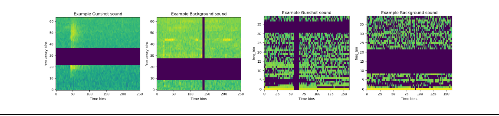
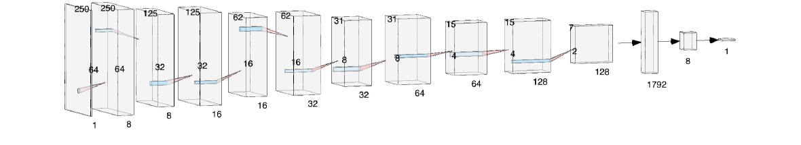

---

*Advisor: Professor Alex Rogers, St Anne's College, University of Oxford.*

  <a class="button" style="flex:1;text-align:center;margin:0;padding:5px 10px;background:rgba(0,0,0,0.1);" href="thesis.pdf">Thesis</a>
  <a class="button" style="flex:1;text-align:center;margin:0;padding:5px 10px;background:rgba(0,0,0,0.1);" href="defense-slides.pdf">Defense slides</a>
  <a class="button" style="flex:1;text-align:center;margin:0;padding:5px 10px;background:rgba(0,0,0,0.1);" href="https://github.com/alexandre-bismuth/BachelorThesis">Code</a>

---

##### Overview

Unsustainable hunting is one of the leading factors of the acceleration of biodiversity loss, prompting the creation of wildlife protection laws in countries home to vast tropical forests. In this context, acoustic detection using low-cost audio loggers offers a practical way to monitor hunting pressure over wide areas.

I optimise a two-stage unconstrained pipeline that employs EfficientNets and Mel Spectrograms for gunshot detection in tropical forests, achieving a **5.72% improvement in F1 score** and a **6.67% improvement in AUPRC** over the current state-of-the-art. To address the storage and real-time limitations of such a system, I then leverage AI-oriented microcontrollers to provide real-time detection and immediate alerts. The resulting compact model, deployable on an **Arduino Nano 33 BLE Sense Rev2**, achieves an **F1 score of 0.840** and an **AUPRC score of 0.849** — offering near state-of-the-art accuracy while drastically reducing computational costs.

Leveraging TinyML for on-device inference, this approach mitigates storage bottlenecks while enabling instant alerts, yielding a scalable, real-time solution that closes the loop between data collection and active law enforcement.

---

##### Contributions

1. **Analytical framework** — crafting a ReLU network that approximates a gunshot signal with any error, providing indications regarding minimal model complexity.
2. **Unconstrained pipeline** — optimising gunshot detection through experimentations with various preprocessing methods and adjustments in model architectures.
3. **Lightweight architecture** — designing gunshot detection systems for embedded devices by combining efficient design choices with model compression methods.

---

##### Comparing preprocessing methods

A comparative study of preprocessing methods (power spectrograms, Mel spectrograms, raw waveforms, LFCCs, and MFCCs) determines how best to capture the distinctive audio signature of a gunshot before classification.

---

##### A TinyML model for biodiversity protection

Through knowledge distillation from the optimised EfficientNetB3 teacher and a model compression pipeline, the compact convolutional network is squeezed to ≈115 thousand parameters so that it fits within the ≈900 kB of storage and 256 kB of RAM available after compression on the Arduino device.

---

##### Key results

+ Optimised pipeline outperforms the current state-of-the-art by **5.72% in F1 score** and **6.67% in AUPRC**.
+ Knowledge distillation lifts the on-device student model by **12.0% in F1 score** and **5.6% in AUPRC**.
+ Final compression yields a **91.4%** reduction to a TensorFlow Lite model and a C header file deployable on the Arduino Nano 33 BLE Sense Rev2.
