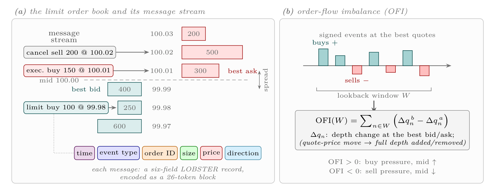
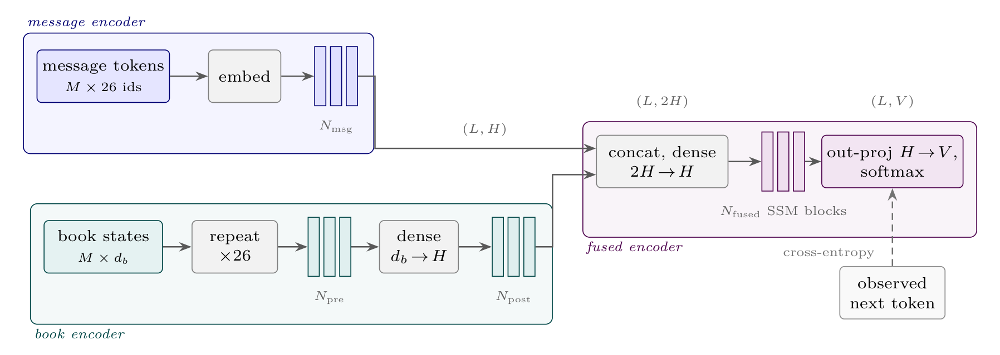
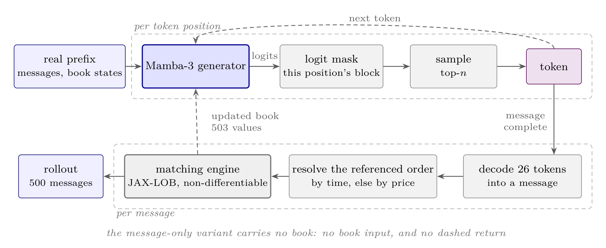
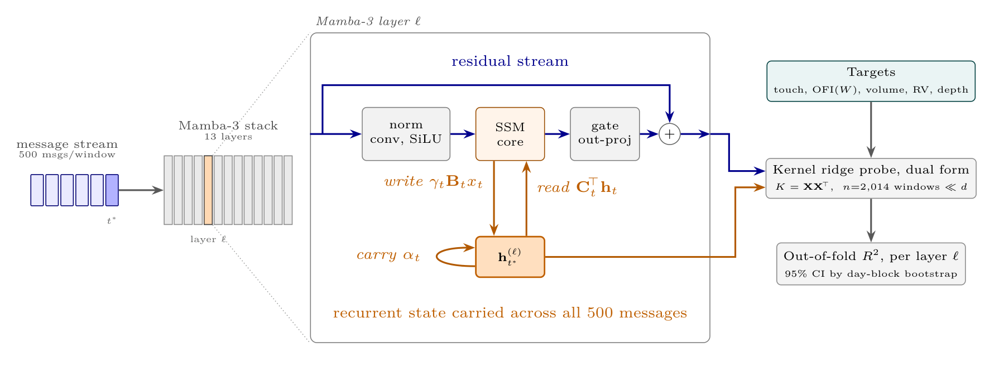
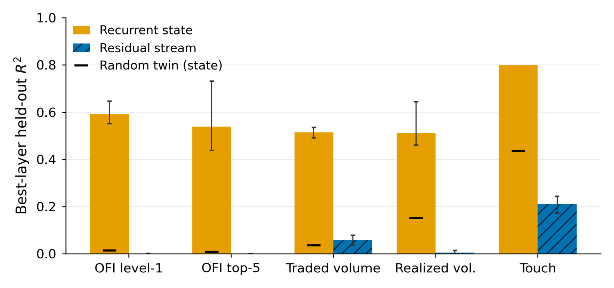
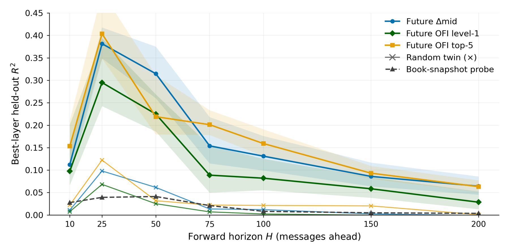
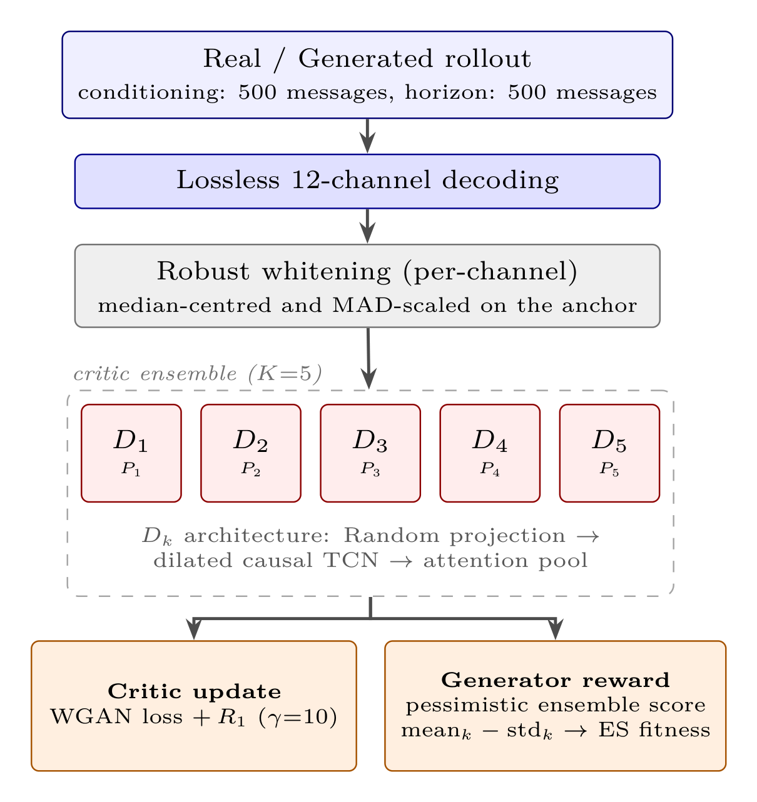
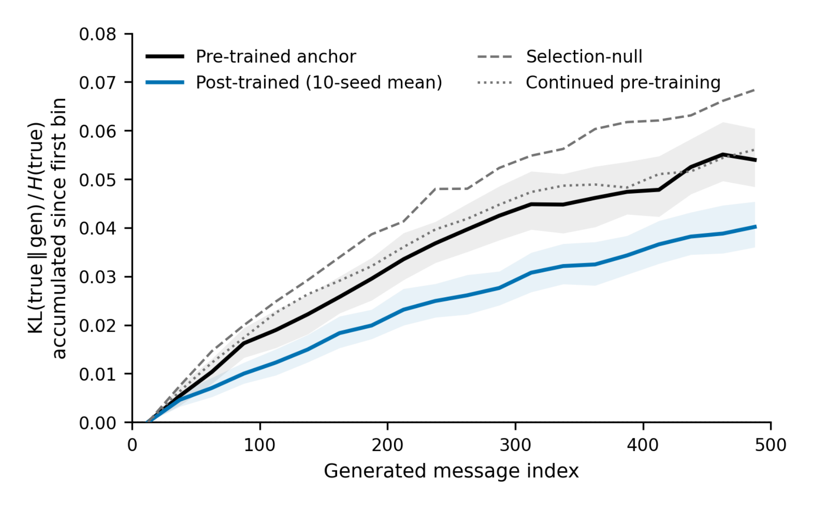

---

*Supervisors: Professor Ani Calinescu and Professor Jakob Foerster, St Anne's College, University of Oxford. Carried out in the British Open-ended Learning and Discovery Lab (BOLD).*

  <a class="button" style="flex:1;text-align:center;margin:0;padding:5px 10px;background:rgba(0,0,0,0.1);" href="thesis.pdf">Thesis</a>
  <a class="button" style="flex:1;text-align:center;margin:0;padding:5px 10px;background:rgba(0,0,0,0.1);" href="https://github.com/ano-ni-mousse/adversarial-post-training-hft">Code</a>

---

##### Overview

Autoregressive foundation models are now the state of the art for simulating markets: pre-train on the message stream of a limit order book, then generate a synthetic market one submission, cancellation and execution at a time.

But distributional realism measures what a model generates, not what it has learned. A model that reproduces the statistics of order flow may have formed an internal representation of the market, or may only have learned regularities of the token stream that the benchmark rewards, and the score cannot tell the two apart. Cross-entropy carries a second problem: it scores each message against the one the market actually sent, so the model is never scored on a generated sequence as a whole. Errors compound over long horizons, and nothing lets you target a particular market property.

This thesis therefore asks two questions of foundation models trained on the limit order book, and takes one chapter each:

- **What does such a model represent?** Which market quantities its recurrent state holds after pre-training by next-message likelihood alone, whether the model uses them, and whether they can be read out.
- **What can it be made to generate?** Whether a second training stage, with an objective defined on whole rollouts and optimised through the matching engine, improves the generated market, and what that stage changes beyond its aggregate score.

---

##### Contributions

1. **The first mechanistic interpretability study of a limit-order-book foundation model.** I characterise what such a model represents: the market's flow, held in the recurrent state of a state-space model, generalising across stocks. It is exploitable in practice, since steering the state shifts the model's beliefs and a linear readout approaches supervised order-book classifiers at a fraction of the inference cost.
2. **An adversarial post-training framework, with improved market realism at negligible cost.** A critic trained online on free-running rollouts, executed through the non-differentiable matching engine, steers an evolutionary search optimiser that updates the pre-trained generator. It consumes under 50M tokens and 12 GPU-hours, a significant refinement after 170 GPU-hours and roughly 48B tokens of pre-training.
3. **A study of the role of adversarial post-training.** It tackles the failure mode that motivated this thesis, slowing the compounding of errors over free-running rollouts, while leaving the pre-trained representation and directional accuracy intact. Ablations then let me set out robust guidelines for such pipelines.

---

##### The market as a stream of messages

Every experiment draws on one corpus of message-level records covering eight US large-capitalisation equities over four years. Each message becomes a 26-token block, and one evaluation window is 500 messages. The quantity I probe for most is order-flow imbalance, the net buy-side pressure over a lookback window, a canonical short-horizon predictor recoverable from the message stream alone.

Two generators of the same family carry the two studies. The interpretability chapter uses an 8.2M-parameter Mamba-3 model, small enough to read out at every layer over thousands of windows and deliberately denied the book, so any book statistic recovered from its state has been reconstructed from order flow rather than read from the input. The post-training chapter uses the dual-stream, book-conditioned generator below, 78.5M parameters trained on roughly 48B tokens of a single instrument, since a specialist is the strongest anchor for the stock it is tested on.

Generation runs that model in closed loop with a matching engine, which is what makes the second question hard: the engine is deterministic but discrete, so no gradient connects a sequence-level score back to the generator's parameters. Rather than learn a differentiable stand-in for the exchange, I keep the true engine in the loop and use optimisers that need only a scalar reward per rollout.

---

##### Where the representation lives

I read the model at two loci, the per-layer residual stream and the per-layer recurrent state, at a fixed message boundary near the end of each window, and fit both with the same kernel ridge probe under day-grouped cross-validation.

In Transformer-based foundation models, mechanistic interpretability probes the residual stream. In this state-space model that locus is nearly empty of market structure, and the representation sits in the recurrent state instead, the single fixed-size vector through which the past reaches the next prediction.

Imbalance, traded volume and realised volatility all decode at *R*² of 0.06 or below from the residual stream, against 0.51 to 0.59 from the recurrent state, because the residual stream's linear memory horizon is only about two to five messages.

What the state holds is flow rather than a snapshot. Imbalance decodes about 4.5 times better from the state than from the best readout of the full book (0.59 against 0.13), and a random-weights twin of identical architecture decodes it at about 0.01, so training is the only source of performance. Mamba-3's state-space duality also makes the state an exact weighted sum of one write per message, which lets me attribute it message by message: the newest message writes 53% of the raw state but only 8% of the decoded imbalance signal, half of which needs the last 66 messages. Order flow lives in a small long-memory subspace that the twin does not have.

---

##### The state is used, and it carries the near future

A probe only establishes that a quantity is present, so I also intervene. Writing a feature's direction into the state moves the model's beliefs as that feature's meaning dictates: the probability of a buy-side next message shifts from 0.46 to 0.56 across a full high-to-low step, and a turbulence push widens the next-price forecast two-fold. Thirty scrambled-label axes at matched norm barely move, so the responses follow the encoded directions rather than the size of the push. Rolled out through the engine, only the volume axis changes what the market actually does, so causal control ranks volume above price above volatility.

The frozen state also carries the near future, with no autoregressive rollout at all. A linear probe explains 38% of the variance of the realised next-25-message mid-price move, against a book-only baseline that never exceeds 0.04 at any horizon. Read as three-class direction it reaches 60.7% accuracy at 50 messages, within about 3 points of DeepLOB's reported 63.9%, even though only a linear readout is trained here; the same classifier reading the raw book snapshot reaches 39.5%. Since prediction needs only a state update and a linear map per message, this is the property most relevant to live trading, where inference speed binds. Flow is also the slowest thing the model learns, still improving after benchmark realism has plateaued, and it transfers to stocks never seen in training.

---

##### Post-training through the matching engine

At each step the generator rolls out 2,048 perturbed continuations through the matching engine, a Wasserstein critic scores each one, and an evolutionary search optimiser turns those scores into an update of rank-4 LoRA factors, with a KL trust region holding the update near the anchor.

<figure style="margin:10px auto;max-width:420px;text-align:center;">
  
</figure>

The critic reads losslessly decoded messages rather than summary statistics, so its representation is learned rather than designed, and absolute prices, times and order IDs are withheld as trivial tells. This choice matters more than anything else in the pipeline: raw messages roughly double the sealed effect of hand-designed descriptors (17.5% against 8.5%), while scoring rollouts through the generator's own backbone looks free but is structurally exploitable.

Because any learned reward is eventually over-optimised, and this one is a live adversary, **the last checkpoint cannot be the deployed one**. Realism improves monotonically to about step 20 and then decays as the generator exploits the critic rather than becoming more realistic, with the critic's own discrimination falling from AUC 0.62 to chance exactly where selection places the turn. Checkpoints are therefore selected by a criterion that uses no critic signal, so a checkpoint cannot select itself through the exploit that inflated its reward.

Scored once on 4,096 disjoint held-out windows from a 28-trading-day panel:

| Model | WS-21 | Δ [95% CI] | Mean-*L*₁ | Δ [95% CI] |
|---|---|---|---|---|
| Pre-trained | 0.194 | | 0.179 | |
| **Post-trained** | **0.160** | **−17.6%** [−19.7, −15.3] | **0.149** | **−17.0%** [−18.9, −15.8] |
| Selection-null | 0.204 | +5.3% [+2.5, +8.1] | 0.193 | +7.8% [+5.9, +9.6] |
| IsoFLOP control | 0.201 | +3.5% [+0.5, +6.5] | 0.186 | +3.9% [+1.9, +5.5] |

Realism improves for every one of the ten seeds, each paired interval excluding zero, on about 50M training tokens, a thousandth of the pre-training corpus. Both controls land above the anchor: a selection-matched null bounds what selection bias alone could manufacture, and continued pre-training at matched compute reproduces none of the gain. Swapping the evolutionary update for GRPO reaches 16.0%, so the reward is optimiser-agnostic.

---

##### What post-training changes

An aggregate score says little on its own, so the last part of the chapter measures what the optimisation does to everything else, starting with the failure mode that motivated it.

Measuring divergence from the true continuation position by position, the pre-trained model's divergence grows 3.1 times from the first to the last 25-message bin, direct evidence that its errors compound over free-running generation. Post-training reduces exactly this accumulation, the growth falling to 2.3 times and the ten-seed mean accumulating 26% less excess divergence. The controls locate the source, since the selection null accumulates 27% more than the anchor and continued pre-training accumulates at the anchor's rate. Neither selection pressure nor extra likelihood training slows the compounding, only the critic's sequence-level signal does.

The gains also follow a regular pattern, since the larger a feature's error in the base model, the more post-training improves it. That follows from the objective: the critic carries no per-feature term, so its discriminative power concentrates wherever the anchor deviates most from the data, and that is where the update is steered hardest. One feature moves the wrong way, and it is informative. The bid-ask spread worsens by 34%, because it is not a marginal of the message stream but a joint property of the standing book, which the critic never observes.

Two capabilities survive the update. Re-running the probing protocol leaves market decoding unchanged, with no target moving outside its confidence interval, so the update that buys 17.6% of realism does so without rewriting what the state encodes. Directional accuracy is preserved at every horizon, which is the informative outcome: nothing in the reward targets it, so the capability is free to degrade and does not. The costs are small and local, at +0.10% cross-entropy plus that spread drift.

---

##### Key results

+ A model trained only to predict the next message holds a representation of the market as a flow rather than a snapshot, in its recurrent state and nowhere else: imbalance decodes at *R*² of 0.59 against 0.13 from the full book and 0.01 from a random-weights twin.
+ That representation is used and readable, since steering the state moves the model's beliefs as each feature's meaning dictates, and a linear readout calls mid-price direction within about 3 points of a supervised classifier.
+ Adversarial post-training through the non-differentiable matching engine improves held-out realism by 17.6% on WS-21 and 17.0% on Mean-*L*₁ for every seed, on 50M tokens and 12 GPU-hours, while both controls end above the anchor.
+ It reaches the failure mode that motivated it, cutting error accumulation over 500 generated messages from 3.1 to 2.3 times, while the pre-trained representation and directional accuracy stay intact.
+ Ablations give design guidelines: decode raw messages for the critic, and select checkpoints without the critic, because the reward is eventually hacked.

Read together, the two studies place the representation with the likelihood objective rather than with scale or input, and post-training as a corrective stage. As a representation, these models are usable today, since a frozen state updated once per message yields forecasts at negligible cost and survives post-training. As a tradable environment they are not yet, because the generated market's response to an agent's own orders is too steep, its spread moves the wrong way under the reward that improves everything else, and its tails are the least trusted part of it.
