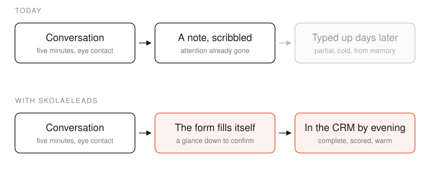
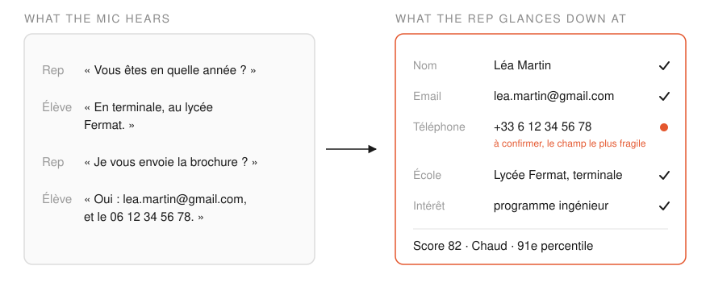
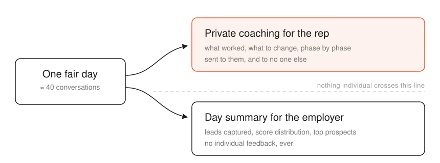

---

*Ongoing personal start-up project. Private repository — Android (Kotlin), Python backend, AWS.*

---

##### The problem

At a student recruitment fair, a company rep has the same conversation forty times a day. Each one contains a lead — a name, an email, a school, a real level of interest — and most of it is lost, because typing it into a form means breaking eye contact with the student standing in front of you. Whatever survives gets typed up days later, cold, from memory.

<figure style="margin:14px auto 4px auto;max-width:680px;text-align:center;">
  
  <figcaption style="font-size:0.82em;opacity:0.75;margin-top:6px;">The same five minutes, twice. The lead is never lost in the second lane because nobody has to remember it.</figcaption>
</figure>

---

##### The product

The rep clips on a Bluetooth microphone, turns it on in the morning, and forgets about it.

SkolaeLeads detects where one conversation ends and the next begins, transcribes them live in French, tells the rep's voice from the student's, and fills the lead form as the student speaks — so the rep only ever has to glance down and confirm.

<figure style="margin:14px auto 4px auto;max-width:680px;text-align:center;">
  
  <figcaption style="font-size:0.82em;opacity:0.75;margin-top:6px;">Four sentences of conversation, turned into a scored lead. The phone number is flagged rather than assumed — it is the one field a neighbouring conversation can quietly corrupt.</figcaption>
</figure>

At the end of the day every lead is scored, pushed to the company's CRM, and the rep gets a private coaching email on how they actually sold. The employer gets an aggregate summary of the day, to a separate mailbox. That split is deliberate: individual feedback belongs to the rep, never to their manager.

<figure style="margin:14px auto 4px auto;max-width:680px;text-align:center;">
  
  <figcaption style="font-size:0.82em;opacity:0.75;margin-top:6px;">The split that makes a rep willing to wear the microphone at all.</figcaption>
</figure>

---

##### How it works

Audio streams from an Android app to a Python relay, which fans it out to **Voxtral Realtime** for live French transcription and **Mistral Small** for the pass that fills the form. At the end of the day, a single pass re-reads the full transcript, scores each conversation, and reconciles it with what the rep confirmed live — human checks always win, the model fills everything else. Scoring runs against a rubric the employer edits themselves, as plain text, with the version stamped on each lead.

Inference is offloaded to usage-based EU APIs, so cost is ~$3.4 per rep per fair day and scales linearly with no concurrency cliff.
